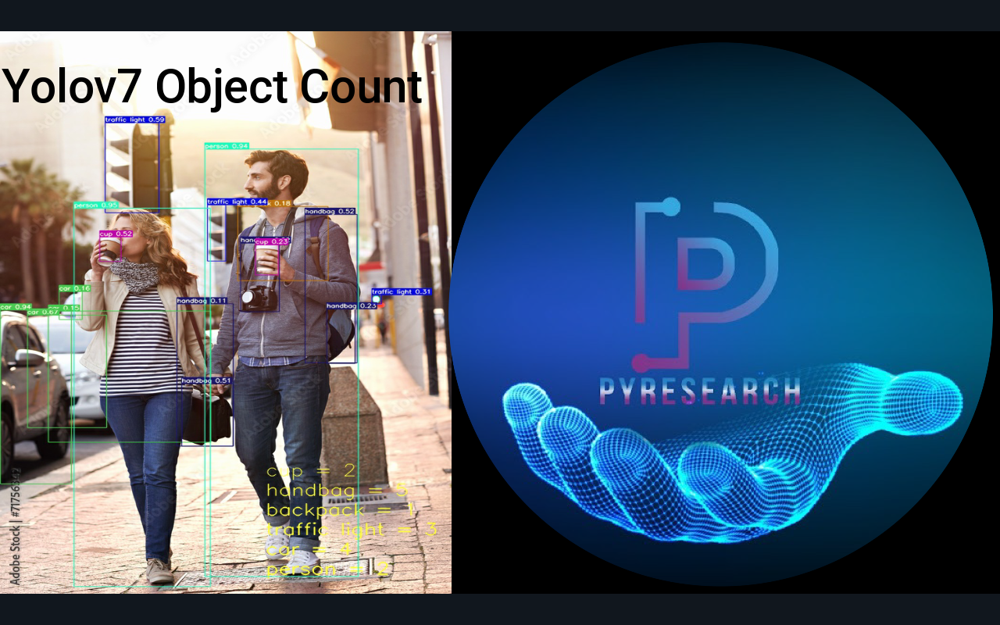

# Yolov7-Object-Counting



## Steps to run Code

- Clone the repository.

  ```sh
  git clone https://github.com/noorkhokhar99/Yolov7-Object-Counting.git
  ```

- Goto the cloned folder.

  ```sh
  cd Yolov7-Object-Counting
  ```

- Upgrade pip with mentioned command below.

  ```sh
  python -m pip install --upgrade pip
  ```

- Install requirements with mentioned command below.

  ```sh
  pip install -r requirements.txt
  ```

- Run the code with mentioned command below.

  ```sh
  python detect_and_count.py --weights yolov7.pt --conf 0.1 --source 2.jpeg
  ```

- Run for webcam

  ```sh
  python detect_and_count.py --weights yolov7.pt --conf 0.1 --source 0
  ```

## Official YouTube Video

- [Official YOLOv7 | Object Detection | Object Counting](https://youtu.be/i6KBg9pURGw)
